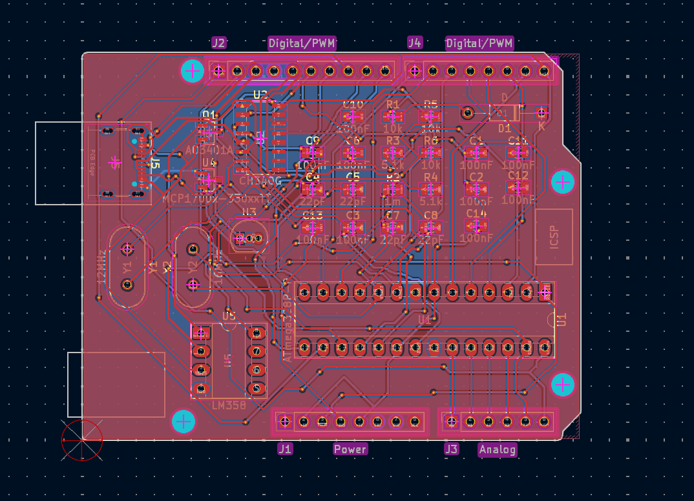
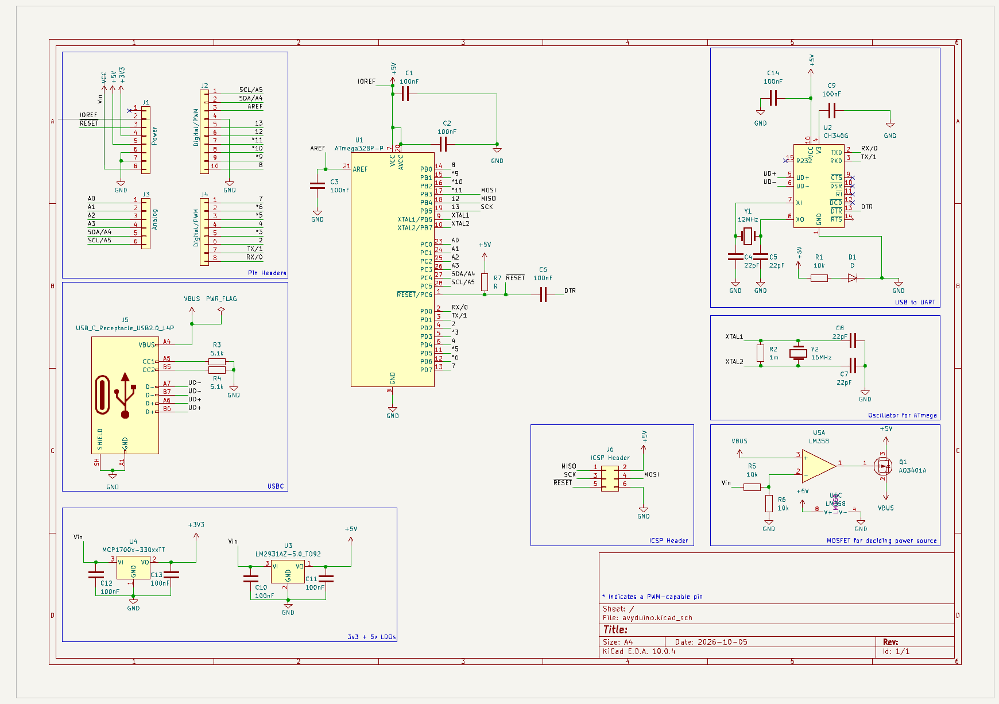
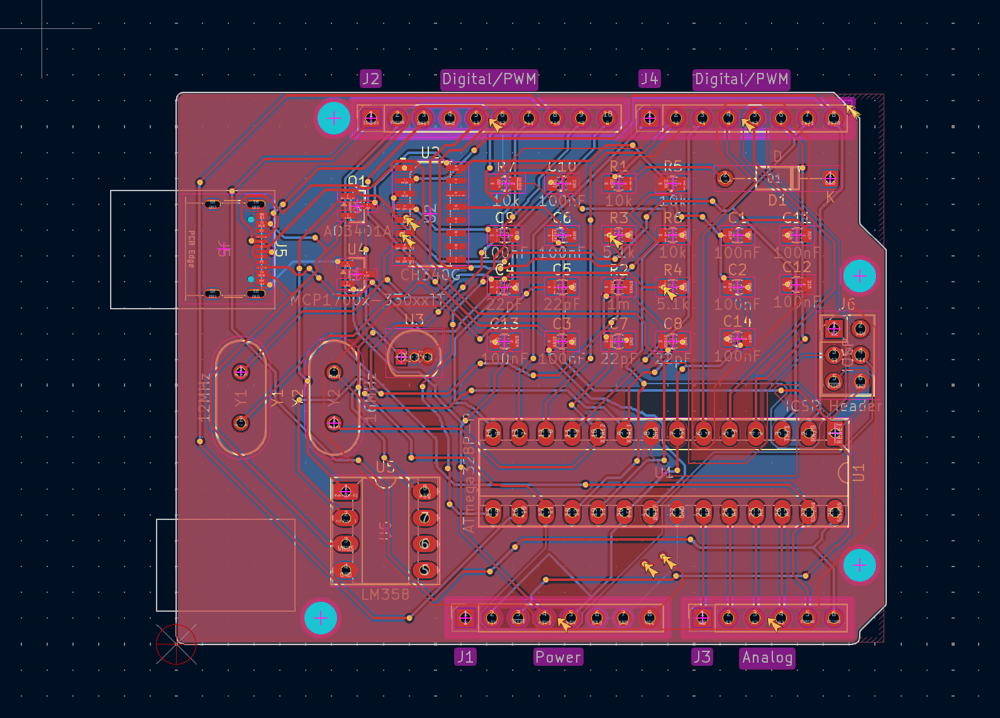
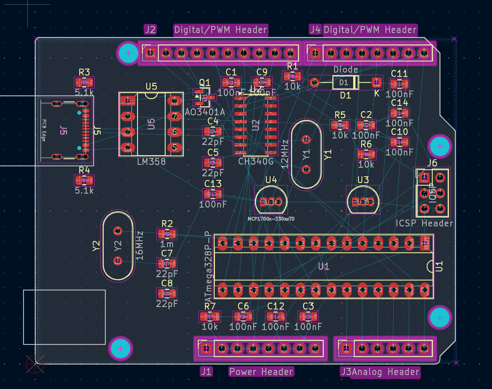
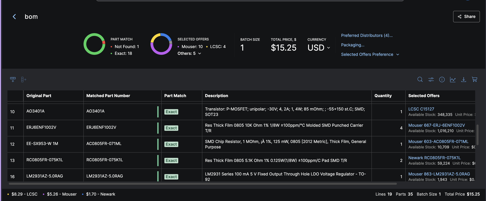

# Oct 5: Started Project and Made Schematic
I had the idea to make my own Arduino UNO based on the same chips but hand solderable and cooler!
I used an ATmega328p for the microcontroller and a CH340G to convert USB to UART. Making the power systems was a bit hard because I had to replicate Arduino's system of using an Op-amp and a MOSFET to decide between using the VBUS from USB and the VIN from the pins. I used KiCad's Arduino UNO template which already had the pin headers set up in the right order. For USB, I went with a USB-C port because its more modern and easier to find a cable for then that obscure USB-B that Arduino's usually come with. A big help in this was [Kai's build your own devboard guide](https://kaipereira.com/journal/build-a-devboard) and online Arduino schematics.

**Total Time Spent: 3 Hours**

# Oct 5: Laid out PCB
I laid out my PCB. The KiCad template already had the shape I needed in it so I didn't need to try drawing it. I tried laying things out to be close to where they need to connect, especially my decoupling capacitors because on past projects I screwed it up and forgot that they should go closer to the place they are connected to.

**Total Time Spent: 2 Hours**

# Oct 5: Routed PCB
I routed my PCB through the night with one GND plane and one plane for VCC. I routed it with standard size traces and kinda went overboard on the vias.

**Total Time Spent: 1.5 Hour**

# Oct 6: Add ICSP Header
I forgot to add an ICSP header for flashing it initially. So I added one to my schematic. I was a bit confused by the fact that it uses an SPI bus that also doubles as PWM pins but now it makes sense, but its still weird that it uses pins that could be occupied. it apparently just pulses really fast during flashing.

**Total Time Spent: 1 Hour**

# Oct 6: Add ICSP Header to PCB
I added the ICSP header to the PCB and routed it. The DRC and ERC both pass, so I think I am good. Next, I just need to source the parts and write my README.

**Total Time Spent: 0.5 Hour**

# Oct 6: Redo Layout of PCB
I had started to put part numbers on things when I realized that my layout wasn't that great and I could make it better and I also wanted to switch the footprint of some things to be easier to solder. I redid the layout and updated some names and footprints.

**Total Time Spent: 1 Hour**

# Oct 6: Make BOMs
I made the BOMs in octopart and exported the production files. I also made one BOM that uses only LCSC parts.

**Total Time Spent: 1.5 Hour**
