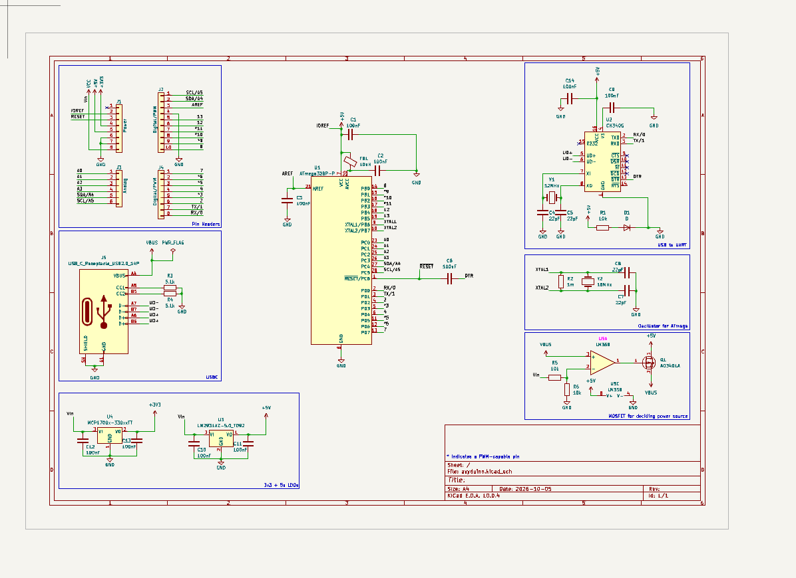
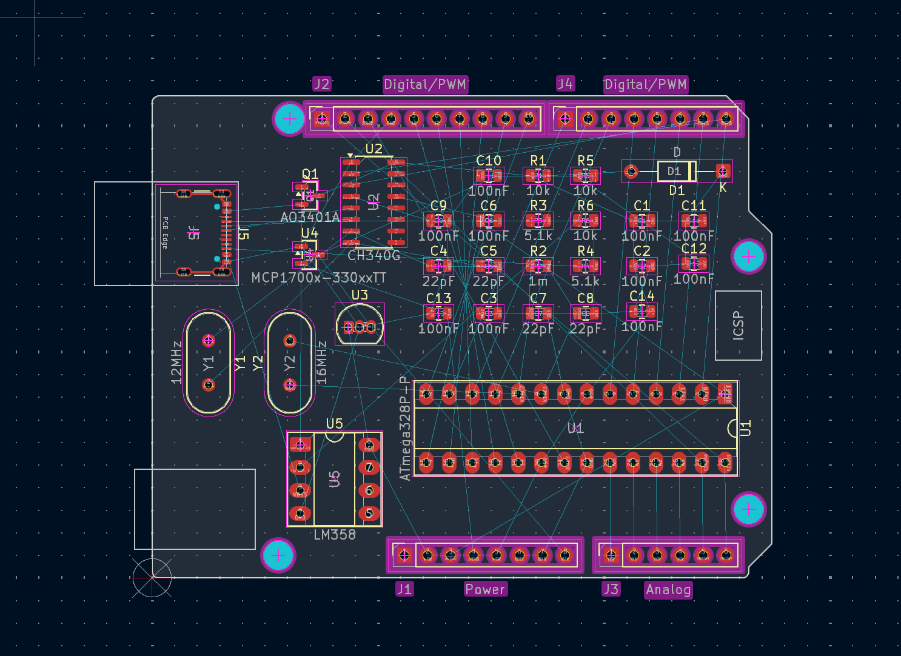

# Oct 5: Started Project and Made Schematic
I had the idea to make my own Arduino UNO based on the same chips but hand solderable and cooler!
I used an ATmega328p for the microcontroller and a CH340G to convert USB to UART. Making the power systems was a bit hard because I had to replicate Arduino's system of using an Op-amp and a MOSFET to decide between using the VBUS from USB and the VIN from the pins. I used KiCad's Arduino UNO template which already had the pin headers set up in the right order. For USB, I went with a USB-C port because its more modern and easier to find a cable for then that obscure USB-B that Arduino's usually come with. A big help in this was [Kai's build your own devboard guide](https://kaipereira.com/journal/build-a-devboard) and online Arduino schematics.

**Total Time Spent: 3 Hours**

# Oct 5: Laid out PCB
I laid out my PCB. The KiCad template already had the shape I needed in it so I didn't need to try drawing it. I tried laying things out to be close to where they need to connect, especially my decoupling capacitors because on past projects I screwed it up and forgot that they should go closer to the place they are connected to.

**Total Time Spent: 2 Hours**
