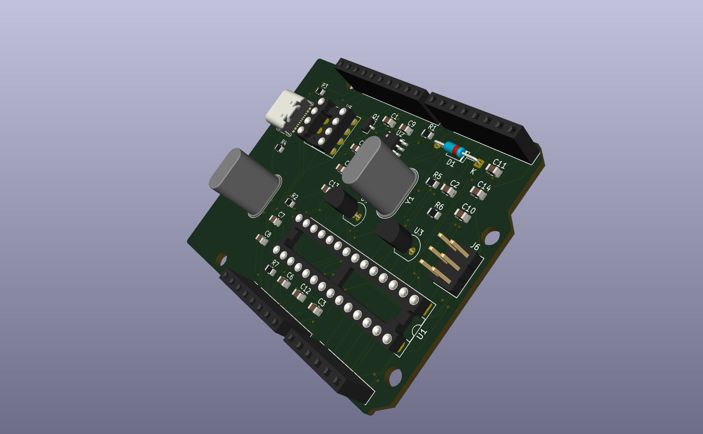

# Avyduino

My take on the classic Arduino UNO. Powered by the same chips, but using a USB-C socket.

## Features
- USB-C
- Exact same pinout as classic Arduino UNO
- Power input switching
- Easy to solder components

## BOM
**FORGE REVIEWERS PLEASE ACTUALLY USE MY CSV**
I compiled 2 BOMs. One is from octopart and has parts sourced from multiple separate suppliers. [BOM here](ordering/bom.xlsx) and one entirely from LCSC. [BOM here](ordering/bom_lcsc_only.xlsx)

## Firmware
NOTE TO LATER SELF: WRITE THE DAMN FIRMWARE FOR THE BOOTLOADER
